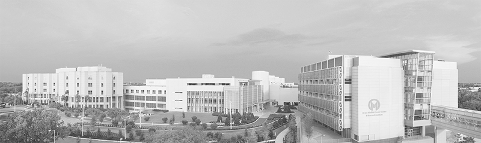

###  A Cancer Signaling Lab
* * *

We are interested in understanding the mechanisms of how protein post-translational modifications shape the proteomic network and how cancer cells rewire central signaling pathways to gain proliferative advantage as well as to remodel the tumor microenvironment. Our goals are to understand the complexity and heterogeneity of human cancers, and use such knowledge to guide novel cancer therapeutic strategies.
* * *

- Address: 12902 USF Magnolia Drive, Tampa, FL 33612
- Email: lixin.wan@moffitt.org
